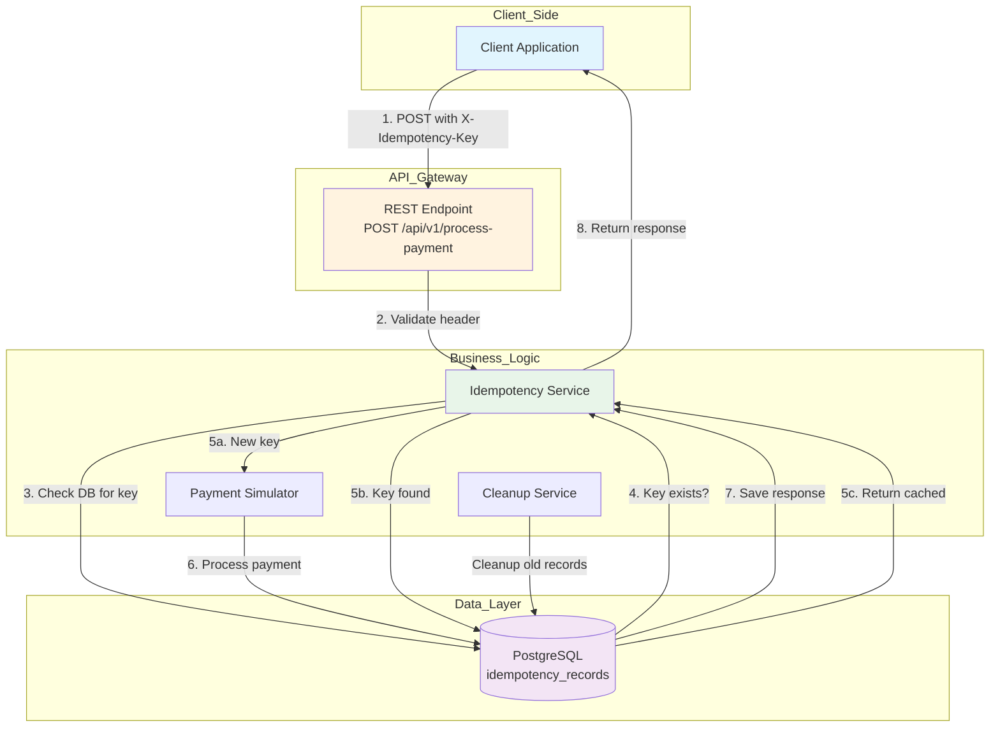
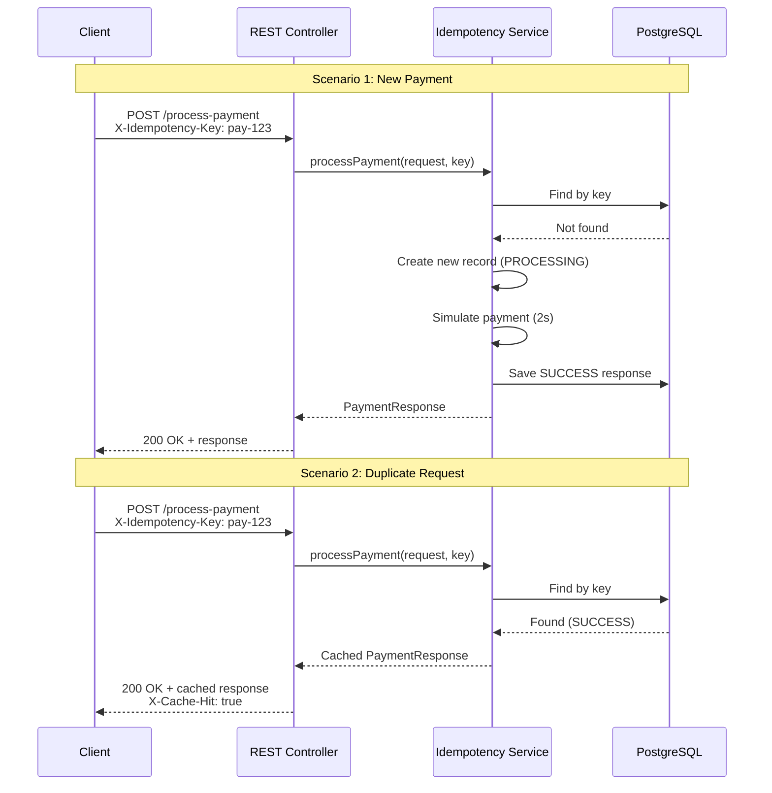

# Idempotency Gateway API 

> A smart payment processing system that ensures every transaction is processed exactly once — no duplicates, no double charges, just smooth payments.

---

## Table of Contents

1. [What is this?](#what-is-this)
2. [Quick Start](#quick-start)
3. [The One Endpoint](#the-one-endpoint)
4. [How to Test It](#how-to-test-it)
5. [Architecture Diagram](#architecture-diagram)
6. [Under the Hood](#under-the-hood)
7. [Database Schema](#database-schema)
8. [API Response Formats](#api-response-formats)
9. [Running the Project](#running-the-project)
10. [Tech Stack](#tech-stack)
11. [What's Next?](#whats-next)

---

## What is this?

Imagine you're buying concert tickets online. You click "Pay" once, but due to a slow network, your browser sends the request twice. Without idempotency, you'd be charged twice! 

**This project solves that problem.** It's a REST API that:
- Accepts payment requests with a unique **idempotency key** (passed via `X-Idempotency-Key` header)
- Stores each request in a database
- On duplicate requests, returns the cached response instead of reprocessing
- Protects against race conditions when multiple requests hit simultaneously

---

## Quick Start

```powershell
# 1. Navigate to the project
cd backend\Idempotency-gateway

# 2. Start the application
.\mvnw.cmd spring-boot:run

# 3. The API is ready at
# http://localhost:8080
```

---

## The One Endpoint

| Method | Path | Description |
|--------|------|-------------|
| `POST` | `/api/v1/process-payment` | Process a payment with idempotency guarantee |

### Request Headers

| Header | Required | Description |
|--------|----------|-------------|
| `X-Idempotency-Key` | ✅ Yes | Unique key to identify the request (e.g., `pay-12345`) |
| `Content-Type` | ✅ Yes | Must be `application/json` |

### Request Body

```json
{
  "amount": 100.00,
  "currency": "USD",
  "customerId": "cust-001",
  "description": "Payment for order #12345"
}
```

---

## How to Test It

###  TEST 1: Successful New Payment

```powershell
Invoke-RestMethod -Uri "http://localhost:8080/api/v1/process-payment" `
    -Method Post `
    -ContentType "application/json" `
    -Headers @{"X-Idempotency-Key" = "pay-test-001"} `
    -Body '{
        "amount": 150.00,
        "currency": "USD",
        "customerId": "cust-889",
        "description": "First payment"
    }'
```

**Expected Response:**
```json
{
  "status": "SUCCESS",
  "transactionId": "txn-abc123",
  "message": "Payment processed successfully",
  "timestamp": "2026-04-28T10:30:00"
}
```

---

###  TEST 2: Duplicate Request (Cache Hit)

Send the **exact same request** again with the same `X-Idempotency-Key`:

```powershell
Invoke-RestMethod -Uri "http://localhost:8080/api/v1/process-payment" `
    -Method Post `
    -ContentType "application/json" `
    -Headers @{"X-Idempotency-Key" = "pay-test-001"} `
    -Body '{
        "amount": 150.00,
        "currency": "USD",
        "customerId": "cust-889",
        "description": "First payment"
    }'
```

**Expected Response:**
- Same as above
- Response header: `X-Cache-Hit: true`
- **No second charge occurs!**

---

###  TEST 3: Missing Idempotency Key

```powershell
Invoke-RestMethod -Uri "http://localhost:8080/api/v1/process-payment" `
    -Method Post `
    -ContentType "application/json" `
    -Body '{
        "amount": 150.00,
        "currency": "USD",
        "customerId": "cust-889"
    }'
```

**Expected Response:** `400 Bad Request`
```json
{
  "error": "Bad Request",
  "message": "X-Idempotency-Key header is required"
}
```

---

###  TEST 4: Conflict (Different Body)

Same key, but **different request body**:

```powershell
Invoke-RestMethod -Uri "http://localhost:8080/api/v1/process-payment" `
    -Method Post `
    -ContentType "application/json" `
    -Headers @{"X-Idempotency-Key" = "pay-test-001"} `
    -Body '{
        "amount": 999.00,
        "currency": "EUR",
        "customerId": "cust-999",
        "description": "Completely different payment"
    }'
```

**Expected Response:** `422 Unprocessable Entity`
```json
{
  "error": "Conflict",
  "message": "Idempotency key already exists with different request body"
}
```

---

## Architecture Diagram

### System Flowchart (Mermaid)



### Sequence Diagram




## Under the Hood

### How Idempotency Works

```
┌─────────────────────────────────────────────────────────────┐
│                    IDEMPOTENCY FLOW                          │
└─────────────────────────────────────────────────────────────┘

Step 1: Client sends request with X-Idempotency-Key header
        │
        ▼
Step 2: Server checks if key exists in database
        │
        ├──▶ NO ──▶ Create new record → Process → Save Response
        │
        └──▶ YES ──▶ Check if request body is same
                    │
                    ├──▶ SAME ──▶ Return cached response
                    │
                    └──▶ DIFFERENT ──▶ Return 422 Conflict
```

### Key Features

| Feature | Description |
|---------|-------------|
| **Duplicate Detection** | Uses `X-Idempotency-Key` header to identify unique requests |
| **Response Caching** | Stores processed responses to return on duplicate requests |
| **Race Condition Handling** | Uses database locking to prevent concurrent processing |
| **Request Body Validation** | Detects if same key is used with different request content |
| **Auto Cleanup** | Scheduled task removes records older than 24 hours |

---

## Database Schema

### Table: `idempotency_records`

| Column | Type | Description |
|--------|------|-------------|
| `id` | BIGINT (PK) | Auto-generated primary key |
| `idempotency_key` | VARCHAR(255) | Unique idempotency key from header |
| `request_body` | TEXT | JSON string of original request |
| `response_body` | TEXT | JSON string of response |
| `status` | VARCHAR(50) | PROCESSING, SUCCESS, FAILED |
| `created_at` | TIMESTAMP | Record creation time |
| `updated_at` | TIMESTAMP | Last update time |

**Indexes:**
- `idx_idempotency_key` on `idempotency_key` (unique)

---

## API Response Formats

### Success Response (200)

```json
{
  "status": "SUCCESS",
  "transactionId": "txn-abc123xyz",
  "message": "Payment processed successfully",
  "timestamp": "2026-04-28T10:30:00"
}
```

### Cache Hit Response (200)

```json
{
  "status": "SUCCESS",
  "transactionId": "txn-abc123xyz",
  "message": "Payment processed successfully",
  "timestamp": "2026-04-28T10:30:00"
}
```
*Plus header: `X-Cache-Hit: true`*

### Bad Request (400)

```json
{
  "error": "Bad Request",
  "message": "X-Idempotency-Key header is required"
}
```

### Conflict (422)

```json
{
  "error": "Conflict",
  "message": "Idempotency key already exists with different request body"
}
```

### Server Error (500)

```json
{
  "error": "Internal Server Error",
  "message": "An unexpected error occurred"
}
```

---

## Running the Project

### Prerequisites

| Tool | Version | Purpose |
|------|---------|---------|
| Java | 17+ | Runtime environment |
| PostgreSQL | 14+ | Database |
| Maven | 3.8+ | Build tool |

### Configuration

The application is pre-configured with:

```properties
# Database connection
spring.datasource.url=jdbc:postgresql://localhost:5432/idempotency_db
spring.datasource.username=postgres
spring.datasource.password=postgres

# Server port
server.port=8080
```

### Start Commands

```powershell
# Using Maven Wrapper (recommended)
.\mvnw.cmd spring-boot:run

# Or using Maven directly
mvn spring-boot:run
```

### Access Points

| Service | URL |
|---------|-----|
| API Endpoint | `http://localhost:8080/api/v1/process-payment` |
| Swagger UI | `http://localhost:8080/swagger-ui.html` |


---

## Tech Stack

| Category | Technology |
|----------|------------|
| **Language** | Java 17 |
| **Framework** | Spring Boot 3.x |
| **Database** | PostgreSQL |
| **Build Tool** | Maven |
| **API Docs** | Swagger/OpenAPI |


---

## What's Next?

This is just the beginning! Here are potential enhancements:

- [ ] **Redis Caching** — Add Redis for faster response caching
- [ ] **TTL Configuration** — Make cleanup duration configurable
- [ ] **Authentication** — Add JWT authentication
- [ ] **Rate Limiting** — Protect against abuse

---

## Design Decisions

### 1. Database Schema

We use PostgreSQL with JPA/Hibernate:
- **idempotency_key** (Primary Key): Unique key from header
- **request_body**: Original request JSON for comparison
- **response_body**: Caches successful response
- **response_status**: HTTP status code
- **status**: Enum (PROCESSING, COMPLETED, FAILED)
- **created_at / processed_at**: Timestamps

### 2. Idempotency Logic

```
1. Receive request with Idempotency-Key
2. Check if key exists in database
   ├── NO: Create new record → Process → Save response → Return
   └── YES: Compare request bodies
           ├── SAME: Return cached response (or wait if PROCESSING)
           └── DIFFERENT: Return 422 Conflict
```

### 3. In-Flight Request Handling

When duplicate request arrives while original is processing:
- The duplicate **waits** for original to complete
- Returns the same response as original

---

## Developer's Choice

### Feature: Auto-Expiration of Idempotency Keys

**Added:** Automatic cleanup of expired idempotency records after 24 hours.

**Why:**
1. **Database Performance**: Prevents unbounded growth
2. **Security**: Reduces replay attack window
3. **Compliance**: Data retention limits
4. **Cost**: Reduces storage costs

**Implementation:** `CleanupService` runs every hour via `@Scheduled`

---

## Project Structure

```
idempotency-gateway/
├── pom.xml
├── src/
│   ├── main/
│   │   ├── java/com/finsafe/idempotency/
│   │   │   ├── IdempotencyGatewayApplication.java
│   │   │   ├── config/SwaggerConfig.java
│   │   │   ├── controller/PaymentController.java
│   │   │   ├── dto/...
│   │   │   ├── entity/IdempotencyRecord.java
│   │   │   ├── repository/IdempotencyRepository.java
│   │   │   └── service/...
│   │   └── resources/application.properties
│   
```

---

## Submission Checklist

- [x] Architecture Diagram: Flowchart and sequence diagram
- [x] Setup Instructions: Database and configuration
- [x] API Documentation: Swagger UI and manual docs
- [x] Design Decisions: Explained choices
- [x] Developer's Choice: Auto-expiration feature
- [x] Run Check: Application starts without errors

---
